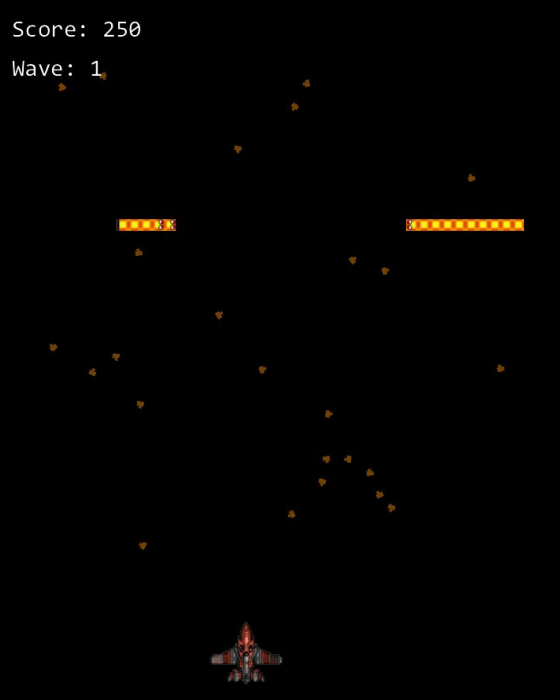

# Centipede 2019
My 1st-year student project showcasing various data structures &amp; algorithms implemented in C++.

Centipede is an application that contains 3 games and multiple data structures/algorithm showcases, all of which were created in C++ using a simple graphics library provided to us. 
**Data structures include**: *Linked list, dynamic list, deque, stack, binary tree, quad tree, and binary heap.* 
**Algorithms include**: *Insertion sort, quick sort, bubble sort, cocktail shaker sort, heap sort, binary search, linear search, depth-first search, breadth-first search, fibonacci search, jump search, and binary tree search.* 
**Games include:** *Centipede, Simon, and Memory.*

All technical details and design choices are outlined in the **Technical Design Document**.  

  
 
Academy of Interactive Entertainment Canberra 
Bachelor of Games and Virtual Worlds
